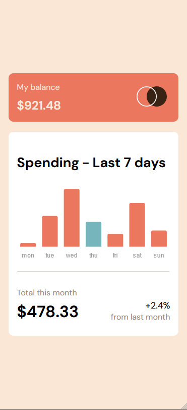
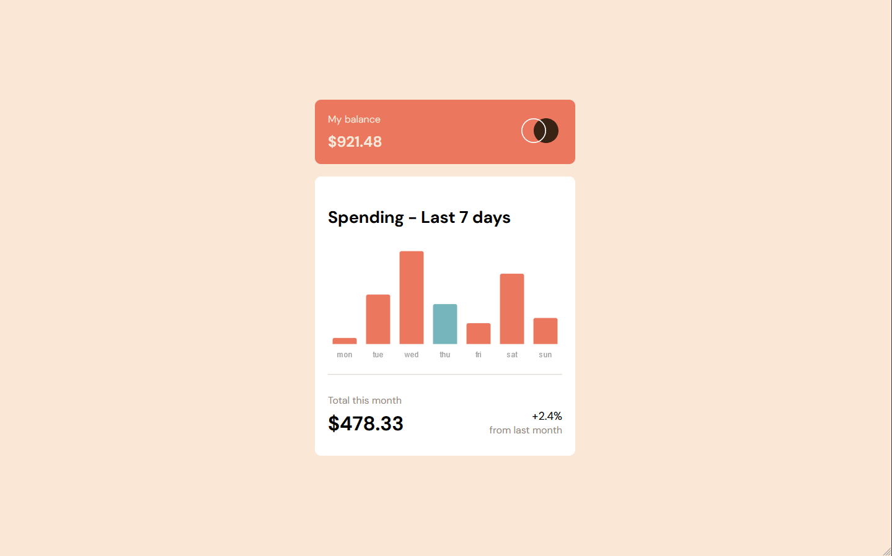
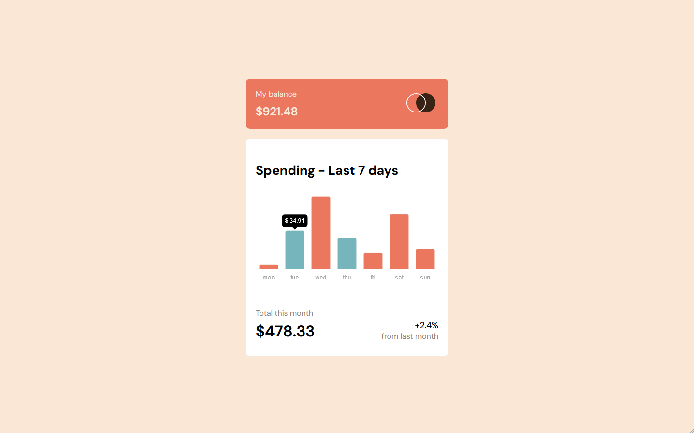

# Frontend Mentor Responsive HTML-CSS-JS - Expenses chart component solution

This is a solution to the [Expenses chart component challenge on Frontend Mentor](https://www.frontendmentor.io/challenges/expenses-chart-component-e7yJBUdjwt).

## Table of contents

- [Overview](#overview)
  - [The challenge](#the-challenge)
  - [Screenshot](#screenshot)
  - [Links](#links)
- [My process](#my-process)
  - [Built with](#built-with)
  - [What I learned](#what-i-learned)
- [Author](#author)

**Note: Delete this note and update the table of contents based on what sections you keep.**

## Overview

### The challenge

Users should be able to:

- View the bar chart and hover over the individual bars to see the correct amounts for each day - ***status*** = (✔)
- See the current day’s bar highlighted in a different colour to the other bars - ***status*** = (✔)
- View the optimal layout for the content depending on their device’s screen size - ***status*** = (✔)
- See hover states for all interactive elements on the page - ***status*** = (✔)
- **Bonus**: Use the JSON data file provided to dynamically size the bars on the chart - ***status*** = (✔)

### Screenshot

### Links

- Live Site URL: [Add live site URL here](https://your-live-site-url.com)
- Solution URL: [Add solution URL here](https://your-solution-url.com)

## My process

### Built with

- Semantic HTML5 markup
- CSS custom properties
- Flexbox
- CSS Grid
- Mobile-first workflow
- Chart.js

### What I learned

I learned about chart.js but I would like to find an alterantive for doing charts that isn't chart.js,
the documentation was confusing and once again stackoverflow had to save the day. 

## Author

- Frontend Mentor - [@HugoMoncada](https://www.frontendmentor.io/profile/HugoMoncada)

